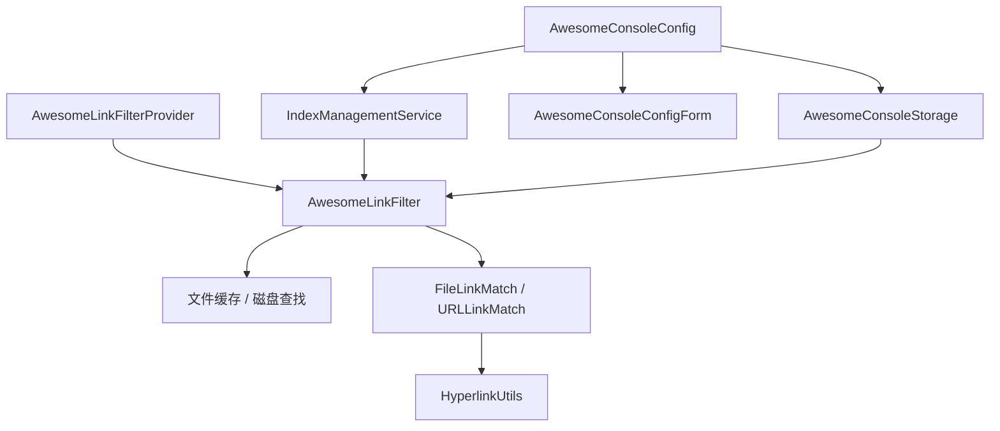
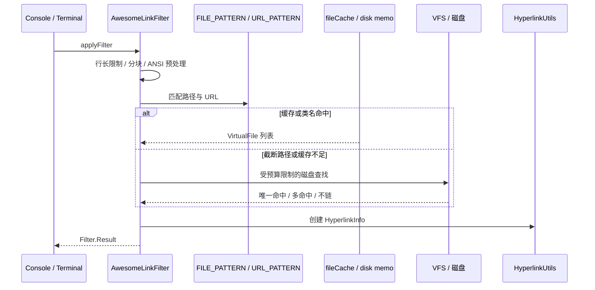

# AGENTS.md

> 使用场景与配置见 [USAGES.md](USAGES.md) | 开发环境与构建见 [GUIDE.md](GUIDE.md)

## 1. 先读什么

按任务选入口，不要一上来通读整个仓库。

| 目标 | 先读 | 再读 |
|------|------|------|
| 理解插件做什么 | 第 2 节、[USAGES.md](USAGES.md) | `src/main/resources/META-INF/plugin.xml` 的 `description` |
| 改控制台链接识别 | `src/main/java/awesome/console/AwesomeLinkFilter.java` | `src/test/java/awesome/console/AwesomeLinkFilterTest.java`、`match/`、`util/HyperlinkUtils.java` |
| 改点击跳转行为 | `src/main/java/awesome/console/util/HyperlinkUtils.java`、`SingleFileFileHyperlinkInfo.java`、`PathListHyperlinkInfo.java`、`MultipleFilesHyperlinkInfoWrapper.java` | 对应测试 |
| 改设置页 / 配置项 | `config/AwesomeConsoleStorage.java` → `AwesomeConsoleConfig.java` → `AwesomeConsoleConfigForm.java` | `AwesomeConsoleConfigTest.java`、[USAGES.md](USAGES.md#配置指南) |
| 改文件索引 / 缓存 | `AwesomeLinkFilter` 的 cache / reload 部分、`config/IndexManagementService.java` | `AwesomeLinkFilterTest` 中 indexing / cache 用例 |
| 改插件注册或版本 | `src/main/resources/META-INF/plugin.xml`、`gradle.properties` | `build.gradle.kts` |
| 搭环境 / 构建失败 | [GUIDE.md](GUIDE.md) | `build.gradle.kts` |

**单一事实来源（Source of Truth）**

| 事实 | 以谁为准 |
|------|----------|
| 插件版本号 | `gradle.properties` 的 `pluginVersion` |
| 扩展点与设置页注册 | `src/main/resources/META-INF/plugin.xml` |
| 配置默认值 | `AwesomeConsoleDefaults` 接口常量 + `AwesomeConsoleStorage` 持久化字段 |
| 发布说明 | `plugin.xml` 的 `change-notes` |
| 用户可见配置语义 | [USAGES.md](USAGES.md) |
| 本机 JDK / 构建排错 | [GUIDE.md](GUIDE.md) |

不要在文档里手写版本号副本；版本只改 `gradle.properties`，发版时同步 `plugin.xml` 的 `change-notes`。

---

## 2. 项目一句话

**Awesome Console X** 是 JetBrains IDE 插件：扫描 Run/Debug Console 与 Terminal 输出，把文件路径、URL、Java 类名变成可点击超链接。源码在 IDE 内打开（可带行列号），其它链接走系统默认程序。

- 插件 ID：`awesome.console.x`
- 包名：`awesome.console`
- 兼容：IntelliJ Platform 2024.2+（Build 242+），Java 21，Gradle 8.x
- 上游：基于 [anthraxx/intellij-awesome-console](https://github.com/anthraxx/intellij-awesome-console)
- 仓库：<https://github.com/github-2013/intellij-awesome-console-x>

它不是通用日志查看器，也不是语言服务器。核心价值是：**正则识别 + 项目文件缓存 + 安全的磁盘回退查找 + 超链接**。

---

## 3. 仓库地图

```
intellij-awesome-console-x/
├── AGENTS.md                          # 本文：AI 阅读与协作
├── USAGES.md                          # 用户配置与场景
├── GUIDE.md                           # 开发环境、构建、排错
├── README.md                          # 对外简介
├── gradle.properties                  # 版本与 Gradle 属性
├── build.gradle.kts                   # 构建
├── src/main/resources/META-INF/plugin.xml
└── src/{main,test}/java/awesome/console/
    ├── AwesomeLinkFilterProvider.java # 扩展点入口；每项目单例 Filter
    ├── AwesomeLinkFilter.java         # 匹配、缓存、磁盘查找、超链接
    ├── AwesomeProjectFilesIterator.java
    ├── config/                        # 设置页、持久化、索引服务
    ├── match/                         # FileLinkMatch / URLLinkMatch
    └── util/                          # 路径、超链接、正则、异常、通知
```

读代码时按层走，避免在约 4200 行的 `AwesomeLinkFilter` 里迷路：

1. **入口**：`plugin.xml` → `AwesomeLinkFilterProvider`
2. **匹配**：`AwesomeLinkFilter.applyFilter` → `FILE_PATTERN` / `URL_PATTERN`
3. **解析**：缓存命中 → 路径后缀/精确相对路径 → 必要时磁盘查找（截断路径、git --stat）
4. **落地**：`HyperlinkUtils` → `SingleFileFileHyperlinkInfo` / `PathListHyperlinkInfo` / 多文件包装器
5. **配置**：`Storage`（状态）← `Config`（Configurable）← `ConfigForm`（UI）
6. **索引**：`IndexManagementService` 调 Filter 的 rebuild/clear，经 MessageBus / progress listener 回写 UI



---

## 4. 核心数据流

控制台每一行都会进 `AwesomeLinkFilter.applyFilter(line, endPoint)`（实现平台 `Filter` 接口）：



阅读 `AwesomeLinkFilter` 时优先搜这些锚点，而不是从头线性读：

| 锚点 | 含义 |
|------|------|
| `applyFilter` | 行级入口 |
| `FILE_PATTERN` / `URL_PATTERN` / `REGEX_ROW_COL` | 识别面 |
| `findCachedCandidates` / `findBestMatchingFiles` | 缓存内解析 |
| `processTruncatedPathOnDisk` / disk search budget | git --stat 等截断路径 |
| `whenCacheReady` / reload / unabsorbed delta | 异步索引与 VFS 增量 |
| `ExceptionHandling.rethrowIfExceptionMustNotBeLogged` | 平台取消信号 |

---

## 5. 改动配方

按意图改，不要只改一个类就结束。

### 新增或收紧一种路径/日志格式

1. 在 `AwesomeLinkFilter` 调整正则或后处理（忽略、git rename、delete mode、截断路径）。
2. 在 `AwesomeLinkFilterTest` 加**正向命中**和**反向不链**（同名文件、删除后残留、截断歧义）。
3. 涉及打开方式时改 `HyperlinkUtils` / `*HyperlinkInfo`，不要把跳转逻辑堆进 Filter。

### 新增配置项

1. `AwesomeConsoleDefaults` + `AwesomeConsoleStorage`（持久化字段与默认值）
2. `AwesomeConsoleConfigForm` / `.form`（UI）
3. `AwesomeConsoleConfig.apply`（校验、写回、发 MessageBus）
4. 若影响缓存：走 `AwesomeConsoleConfigListener.ConfigChangeType`，决定增量还是强制 rebuild
5. 更新 [USAGES.md](USAGES.md) 对应配置表
6. `AwesomeConsoleConfigTest` 覆盖：空值、非法正则、Apply 后 UI 与 storage 一致

### 改索引或缓存

1. 默认异步 rebuild；EDT 上不要做全量扫盘。
2. 写缓存用短 write lock；build 阶段尽量无锁，再 atomic swap。
3. dispose / generation 之后禁止把过期 snapshot 换回去。
4. 磁盘查找：有预算、有边界（content roots / excluded roots）、不跟随指向根外的目录 symlink。
5. 设置页进度只消费 Filter 的 progress listener，不要再开一套计数。

### 发版

1. 只改 `gradle.properties` 的 `pluginVersion`
2. 在 `plugin.xml` `change-notes` **顶部**追加新版本（英文条目，风格与既有版本一致）
3. 依据该版本相对上一发布分支的 commit 写说明，不要抄旧条目

---

## 6. 硬约束

这些规则比“看起来能跑”更优先。违反通常会在生产里表现为卡死、吞掉取消、或误链到错误文件。

1. **所有 catch 必须先** `ExceptionHandling.rethrowIfExceptionMustNotBeLogged(e)`，再打日志或吞掉。`ControlFlowException`（含 `ProcessCanceledException`）不能当普通错误。
2. **禁止在 EDT 上做全量索引、递归磁盘扫描、或持有 cache write lock 做重活。** 同步 rebuild 要有超时；EDT 上应跳过或改异步。
3. **锁顺序保持稳定。** 缓存是 `ReentrantReadWriteLock` + `ConcurrentHashMap`。读操作用读锁；不要在持读锁时再调会拿写锁或 `ReadAction` 的路径（死锁）。
4. **改正则必须跑全量 `AwesomeLinkFilterTest`。** Pattern 用 `UNICODE_CHARACTER_CLASS`，编译结果要缓存，Matcher 用 `ThreadLocal`，避免灾难性回溯。
5. **误链比漏链更严重。** git delete / rename / `--stat` 截断、同名文件、目录后缀命中，必须有“不该成链”的测试。磁盘多命中不要悄悄链第一个。
6. **测试框架是 JUnit 4**（`junit:junit:4.13.2`）。平台用例继承 `BasePlatformTestCase`、方法名 `testXxx`；纯单元测试可用 `@org.junit.Test`。不要引入 JUnit 5。
7. **对话框用 IntelliJ `Messages`，不要用 `JOptionPane`。**
8. **忽略模式关闭时应允许空正则**；开启时才校验非空且为合法 regex。Apply 后 UI 从 storage 回读，不要只改内存里的表单字段。
9. **注释用简体中文**；专有名词（Filter、VFS、EDT、Pattern）保留英文。
10. **不要顺手大重构。** 只改任务需要的文件；不要把 `AwesomeLinkFilter` 拆文件，除非任务就是拆。

---

## 7. 测试怎么读、怎么补

| 测试类 | 什么时候必须动 |
|--------|----------------|
| `AwesomeLinkFilterTest` | 路径/URL/git/磁盘查找/缓存/索引语义 |
| `AwesomeLinkFilterProviderTest` | 项目级 Filter 单例、dispose、disposed project |
| `AwesomeConsoleConfigTest` | 设置页、Apply、索引按钮、忽略模式、进度 UI |
| `WindowsPathValidationTest` | Windows 非法路径、伪 scheme、`Paths.get` 前校验 |
| `FileUtilsTest` | 路径展开、symlink、JAR refresh 等工具行为 |
| `IntegrationTest` | 共享测试路径常量与协议模板 |

补测试的默认姿势：

- 每个新匹配格式：**至少 1 个应链 + 1 个不应链**
- git 场景要覆盖 rename 新旧两侧、delete 后同名干扰、`--stat` 截断与磁盘唯一/非唯一
- 缓存测试要覆盖 generation、dispose 后 swap、VFS delta 在 reload 期间的吸收
- 断言超链接类型时分清单文件、多文件 chooser、以及“刻意不链”

跑测试：

```bash
./gradlew test
./gradlew test --tests awesome.console.AwesomeLinkFilterTest
./gradlew runIde          # 沙箱 IDE 手测 Console / Terminal
./gradlew buildPlugin     # 产出插件包
```

环境与 JDK 问题看 [GUIDE.md](GUIDE.md)，不要在 `build.gradle.kts` 里硬编码本机 `JAVA_HOME`。

---

## 8. 实现时容易踩的坑

- **Filter 按项目缓存。** `AwesomeLinkFilterProvider` 对每个 `Project` 复用一个 Filter；项目关闭必须 `Disposer.dispose`，否则缓存泄漏。
- **配置变更不是“改完字段就结束”。** 忽略模式、文件类型、搜索开关会决定是否强制 rebuild；只改 `OTHER_CHANGED` 不会重建索引。
- **磁盘查找有预算和 memo。** 被 budget 拒绝的后缀不要写入 memo；VFS 相关变更要能驱逐对应 memo。
- **截断路径经常不是完整相对路径。** 用 first-directory locate + 后缀边界，而不是 `endsWith` 整串瞎撞。
- **符号链接解析是实验开关。** 默认磁盘搜索不得走出 content roots 去跟随目录 symlink。
- **`.form` 由 Gradle 插桩。** 改 `AwesomeConsoleConfigForm.form` 后走 Gradle 编译，不要手写 `$$$setupUI$$$`。
- **通知可被用户关掉。** 逻辑成功/失败不要只依赖气球通知；设置页状态文本仍要更新。

---

## 9. 文档怎么分工

| 文件 | 读者 | 写什么 | 不要写什么 |
|------|------|--------|------------|
| **AGENTS.md** | AI / 协作者 | 阅读顺序、入口、约束、改动配方 | 逐配置项说明、JDK 安装步骤 |
| **USAGES.md** | 用户 | 配置含义、场景、默认值 | 类内部实现 |
| **GUIDE.md** | 开发者 | JDK、构建、日志、GUI 设计器 | 架构全景 |
| **README.md** | 路过的人 | 一句话介绍与安装 | 实现细节 |
| **plugin.xml change-notes** | 插件市场 / 用户 | 按版本的英文变更 | 内部重构流水账 |

更新约定：行为或配置语义变了，先改代码与测试，再改 `USAGES.md`；只有协作方式变了才改本文。

---

## 10. 协作口吻

- 用仓库里已有的名字说话：`AwesomeLinkFilter`、`IndexManagementService`、`change-notes`，不要自造层名。
- 回答实现问题先给“改哪个类、哪条路径”，再给设计解释。
- 不确定时打开测试用例：这个仓库的测试往往比注释更接近真实语义。
- 保持改动可审查：一个意图一组文件，发版总结对应当前版本相对上一版本的 commit。
