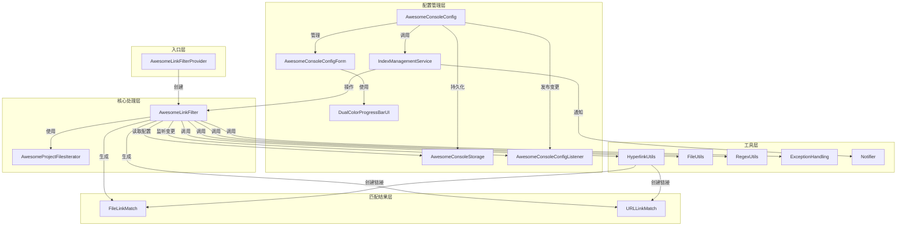
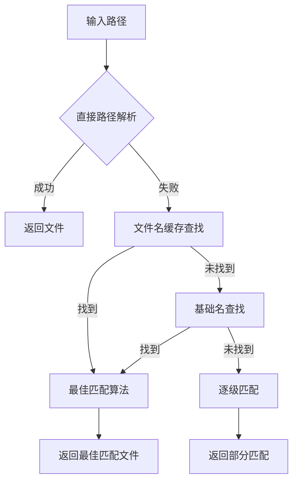

# Awesome Console X - 项目架构文档

> 📖 使用场景与案例请参考 [USAGES.md](USAGES.md) | 开发配置与常见问题请参考 [GUIDE.md](GUIDE.md)

## 项目概述

**Awesome Console X** 是一个为 JetBrains IDE 开发的插件，专门用于增强控制台和终端中的链接功能。该插件能够智能识别并高亮显示控制台输出中的文件路径、URL 和类名，使其变为可点击的超链接，极大提升开发效率。

### 基本信息

| 属性 | 值 |
|------|-----|
| **项目名称** | Awesome Console X |
| **插件 ID** | awesome.console.x |
| **当前版本** | 0.1337.38 |
| **开发者** | xingjiexu (553926121@qq.com) |
| **供应商** | awesome console x productions |
| **GitHub** | https://github.com/github-2013/intellij-awesome-console-x |
| **许可证** | MIT License |
| **原始项目** | 基于 anthraxx/intellij-awesome-console 继续开发 |

### 兼容性要求

| 组件 | 版本要求 |
|------|----------|
| **IDE 版本** | IntelliJ IDEA 2024.2+ (Build 242+) |
| **Java 版本** | Java 21 (推荐 Amazon Corretto 21) |
| **构建工具** | Gradle 8.x |
| **支持平台** | 所有基于 IntelliJ 的 IDE |

---

## 核心功能特性

### 智能链接识别

插件能够自动识别并高亮以下类型的链接：

| 链接类型 | 描述 | 示例 |
|----------|------|------|
| **源代码文件** | 项目中的源代码文件路径 | `src/main/java/MyClass.java:42` |
| **普通文件** | 文件系统中的任意文件路径 | `/home/user/document.txt` |
| **URL 链接** | HTTP(S)、FTP、File 等协议 | `https://github.com/user/repo` |
| **Java 类名** | 完全限定类名 | `com.example.MyClass:150` |
| **JAR 文件** | JAR 包内的文件路径 | `jar:file:/path/lib.jar!/Class.class` |

### 高级路径匹配

- **多平台支持**: Windows (`C:\path\file.java`) 和 Unix (`/path/file.java`) 路径
- **行列号定位**: 支持 `file.java:10:5` 格式的精确定位
- **用户目录**: 自动解析 `~` 符号到用户主目录
- **符号链接**: 智能解析符号链接到实际文件
- **Unicode 支持**: 完整支持 Unicode 路径和文件名
- **Node.js 生态**: 支持 `.pnpm` 等现代包管理器路径
- **引号包围**: 处理带空格的路径 `"path with spaces/file.txt"`
- **Rust 模块**: 支持 Rust 模块路径格式
- **ANSI 颜色保留**: 支持现代终端提示符的 ANSI 转义序列
- **MSVC C++ 格式**: 支持 MSVC 编译器错误格式 (`file.cpp(42)`)
- **命令行参数过滤**: 智能过滤常见命令参数，防止误识别为文件链接

### 高性能缓存系统

- **内存缓存**: 使用 `ConcurrentHashMap` 维护项目文件缓存
- **实时更新**: 监听 VFS 事件，自动更新文件缓存
- **智能索引**: 支持文件名和基础名的快速查找
- **线程安全**: 使用读写锁保证并发安全
- **最佳匹配**: 智能算法选择最匹配的文件路径

## 配置体系

通过 `Settings → Other Settings → Awesome Console X` 打开配置面板。配置项按功能分为四组：

| 配置组 | 核心配置项 | 架构关联 |
|--------|-----------|----------|
| **General Settings** | 行长度限制、分块处理、通知开关 | 控制 Filter 处理行为和全局通知 |
| **Match Settings** | URL/文件/类名匹配开关、结果限制、忽略模式 | 控制正则匹配引擎的启用范围和过滤策略 |
| **Advanced Settings** | 符号链接解析、ANSI 颜色保留、非文本文件类型 | 控制文件解析行为和超链接样式 |
| **File Index Management** | 索引重建、缓存清除、统计信息 | 管理 `IndexManagementService` 的文件缓存 |

配置数据由 `AwesomeConsoleStorage` 持久化到 `awesomeconsole.xml`，变更通过 `AwesomeConsoleConfigListener` 的 MessageBus 机制通知各组件更新状态。

> 📖 各配置项的完整说明、默认值及推荐配置方案请参考 [USAGES.md](USAGES.md#配置指南)

---

## 技术架构

### 项目结构

```
intellij-awesome-console-x/
├── src/main/java/awesome/console/
│   ├── AwesomeLinkFilter.java              # 核心过滤器
│   ├── AwesomeLinkFilterProvider.java      # 过滤器提供者
│   ├── AwesomeProjectFilesIterator.java    # 文件迭代器
│   ├── config/                             # 配置管理模块
│   │   ├── AwesomeConsoleConfig.java       # 配置界面
│   │   ├── AwesomeConsoleConfigForm.java   # GUI 表单
│   │   ├── AwesomeConsoleConfigForm.form   # GUI 设计文件
│   │   ├── AwesomeConsoleConfigListener.java # 配置变更监听器
│   │   ├── AwesomeConsoleDefaults.java     # 默认配置
│   │   ├── AwesomeConsoleStorage.java      # 持久化存储
│   │   ├── DualColorProgressBarUI.java     # 双色进度条UI
│   │   └── IndexManagementService.java     # 索引管理服务
│   ├── match/                              # 匹配结果模型
│   │   ├── FileLinkMatch.java              # 文件链接匹配结果
│   │   └── URLLinkMatch.java               # URL 链接匹配结果
│   └── util/                               # 工具类库
│       ├── ExceptionHandling.java          # 平台异常处理
│       ├── FileUtils.java                  # 文件操作工具
│       ├── HyperlinkUtils.java             # 超链接创建工具
│       ├── IntegerUtil.java                # 整数安全解析
│       ├── LazyInit.java                   # 延迟初始化容器
│       ├── LazyVirtualFileList.java        # 虚拟文件懒加载列表
│       ├── ListDecorator.java              # 列表装饰器
│       ├── MultipleFilesHyperlinkInfoWrapper.java # 多文件超链接包装
│       ├── Notifier.java                   # 通知工具
│       ├── RegexUtils.java                 # 正则表达式工具
│       ├── SingleFileFileHyperlinkInfo.java # 单文件超链接信息
│       └── SystemUtils.java                # 系统环境工具
├── src/main/resources/META-INF/
│   └── plugin.xml                          # 插件配置文件
├── src/test/java/awesome/console/
│   ├── AwesomeLinkFilterTest.java          # 核心测试
│   ├── AwesomeConsoleConfigTest.java       # 配置测试
│   └── IntegrationTest.java                # 集成测试
├── build.gradle.kts                        # Gradle 构建配置
├── gradle.properties                       # Gradle 属性配置
└── README.md & CODEBUDDY.md                # 项目文档
```

### 组件交互关系



### 核心数据流

```mermaid
sequenceDiagram
    participant Console as 控制台输出
    participant Filter as AwesomeLinkFilter
    participant Regex as 正则匹配引擎
    participant Cache as 文件缓存系统
    participant VFS as VirtualFileSystem
    participant Link as 超链接创建

    Console->>Filter: applyFilter(line, entireLength)
    Filter->>Filter: 行长度检查 & 分块处理
    Filter->>Regex: FILE_PATTERN / URL_PATTERN 匹配
    Regex-->>Filter: 匹配结果列表
    
    loop 每个文件路径匹配
        Filter->>Cache: 查找文件 (文件名缓存)
        alt 缓存命中
            Cache-->>Filter: VirtualFile
        else 缓存未命中
            Filter->>Cache: 基础名查找
            alt 基础名命中
                Cache-->>Filter: VirtualFile
            else 未命中
                Filter->>VFS: 直接路径解析
                VFS-->>Filter: VirtualFile / null
            end
        end
        Filter->>Link: 创建 HyperlinkInfo
    end
    
    Filter-->>Console: Filter.Result (可点击超链接列表)
```

### 核心组件架构

#### AwesomeLinkFilter (核心过滤器)

```java
public class AwesomeLinkFilter implements Filter, DumbAware
```

**核心职责**:
- 解析控制台输出的每一行文本
- 使用复杂正则表达式匹配文件路径和 URL
- 维护高性能文件缓存系统
- 创建可点击的超链接

**关键正则表达式**:
```java
FILE_PATTERN           // 匹配文件路径 (支持多种格式)
URL_PATTERN            // 匹配 URL 链接
STACK_TRACE_ELEMENT_PATTERN  // 匹配 Java 堆栈跟踪
REGEX_ROW_COL          // 匹配行号和列号
```

**高性能缓存机制**:
- `ConcurrentHashMap<String, List<VirtualFile>>` 文件缓存
- `ReentrantReadWriteLock` 线程安全保护
- VFS 事件监听自动更新缓存
- DumbMode 监听在索引更新后重建缓存

#### AwesomeConsoleConfig (配置管理)

```java
public class AwesomeConsoleConfig implements Configurable
```

**功能特性**:
- 管理 GUI 配置表单
- 验证正则表达式有效性
- 检查必需的正则表达式分组
- 配置数据持久化

#### AwesomeConsoleStorage (数据持久化)

```java
@State(name = "Awesome Console Config", 
       storages = @Storage("awesomeconsole.xml"))
public class AwesomeConsoleStorage implements PersistentStateComponent
```

**存储功能**:
- 配置保存到 `awesomeconsole.xml`
- 自动序列化/反序列化
- 编译和缓存正则表达式 Pattern

#### IndexManagementService (索引管理服务)

```java
public class IndexManagementService
```

**核心职责**:
- 手动重建文件索引
- 清除索引缓存
- 索引统计信息查询
- 操作进度通知

**关键特性**:
- **防抖机制**: 5秒间隔限制，防止频繁重建
- **操作互斥**: 同一时间只允许一个索引操作
- **异步执行**: 后台线程池执行，不阻塞 UI
- **进度回调**: 实时更新操作进度和统计信息
- **线程安全**: EDT 和后台线程的正确协调

**回调接口**:
```java
public interface ProgressCallback {
    void onStart(String operationType);           // 操作开始
    void onProgress(int current, int total, ...); // 进度更新
    void onComplete(String operationType, ...);   // 操作完成
    void onError(String operationType, ...);      // 操作失败
}
```

**使用场景**:
- 用户手动触发索引重建（Settings 面板）
- 清除索引缓存释放内存
- 查看索引统计信息（文件数、缓存大小等）
- 索引操作进度实时反馈

#### AwesomeConsoleConfigListener (配置变更监听器)

```java
public interface AwesomeConsoleConfigListener
```

**核心职责**:
- 定义配置变更事件的 Topic，基于应用级别 MessageBus
- 当用户修改插件配置并点击 Apply/OK 时触发通知
- 通知各组件（如 AwesomeLinkFilter）配置已变更，需要更新状态

**变更类型枚举 (ConfigChangeType)**:
- `SEARCH_FILES_CHANGED`: 文件搜索功能启用/禁用
- `SEARCH_CLASSES_CHANGED`: 类搜索功能启用/禁用
- `IGNORE_PATTERN_CHANGED`: 忽略模式变更（包括启用/禁用和正则表达式变更）
- `FILE_TYPES_CHANGED`: 文件类型过滤变更（包括启用/禁用和文件类型列表变更）
- `OTHER_CHANGED`: 其他配置变更（不需要重建缓存）

#### DualColorProgressBarUI (双色进度条UI)

```java
class DualColorProgressBarUI extends BasicProgressBarUI
```

**核心职责**:
- 自定义双色进度条，可视化展示索引操作中匹配文件与忽略文件的比例
- 墨绿色表示匹配的文件，黄色表示忽略的文件
- 自动适配亮色/暗色主题

**关键特性**:
- **双色渐进显示**: 匹配文件和忽略文件各自独立的颜色区域
- **主题适配**: 使用 `JBColor` 自动适配 IDE 亮色/暗色主题
- **实时更新**: 支持动态更新匹配和忽略文件的百分比
- **文本绘制**: 支持在进度条上显示文本信息

#### ExceptionHandling (异常处理工具)

```java
public class ExceptionHandling
```

**核心职责**:
- 处理 IntelliJ Platform 的控制流异常 (ControlFlowException)
- 确保控制流异常不被意外捕获和吞没

**关键方法**:
```java
public static void rethrowIfExceptionMustNotBeLogged(Exception e)
```
- 检查异常是否为 `ControlFlowException`（如 `CannotReadException`）
- 如果是控制流异常，立即重新抛出，防止被 catch 块吞没
- 在所有 catch 块中调用，确保 IntelliJ 平台的取消信号能正确传播

### match 包 - 匹配结果模型

匹配结果层定义了 Filter 识别出的链接数据结构，供后续超链接创建使用。

| 类 | 职责 | 核心字段 |
|----|------|----------|
| **FileLinkMatch** | 封装文件路径匹配结果 | `match`(匹配文本)、`path`(文件路径)、`linkedRow`(行号)、`linkedCol`(列号)、`virtualFile`(目标文件) |
| **URLLinkMatch** | 封装 URL 匹配结果 | `match`(匹配文本)、`url`(完整URL) |

**与 Filter 的关系**: `AwesomeLinkFilter` 通过正则匹配生成 `FileLinkMatch` / `URLLinkMatch` 实例，再由 `HyperlinkUtils` 将其转换为 IDE 可点击的 `HyperlinkInfo`。

### util 包 - 工具类架构

工具层按职责分为以下几类：

#### 核心工具（直接支撑 Filter 运作）

| 类 | 职责 |
|----|------|
| **HyperlinkUtils** | 将匹配结果转换为 IDE 超链接 (`HyperlinkInfo`)，处理单文件/多文件选择逻辑 |
| **FileUtils** | 文件路径解析、路径标准化、用户目录展开 (`~`)、符号链接解析 |
| **RegexUtils** | 正则表达式编译验证、Pattern 缓存、分组检查 |

#### 超链接实现

| 类 | 职责 |
|----|------|
| **SingleFileFileHyperlinkInfo** | 单文件超链接实现，点击后直接打开目标文件并定位到行列 |
| **MultipleFilesHyperlinkInfoWrapper** | 多文件超链接包装器，弹出文件选择对话框供用户选择 |

#### 基础设施工具

| 类 | 职责 |
|----|------|
| **ExceptionHandling** | 平台控制流异常处理，防止 `ControlFlowException` 被吞没 |
| **Notifier** | 统一的通知管理，封装 IntelliJ 通知 API |
| **IntegerUtil** | 安全的整数解析，处理行号/列号字符串转换 |
| **SystemUtils** | 系统环境检测（操作系统类型、路径分隔符等） |

#### 数据结构工具

| 类 | 职责 |
|----|------|
| **LazyInit** | 泛型延迟初始化容器，避免重复计算 |
| **LazyVirtualFileList** | 虚拟文件的懒加载列表，按需加载文件信息 |
| **ListDecorator** | 列表装饰器，提供增强的列表操作 |

### 测试架构

#### 测试覆盖率

| 测试类 | 测试数量 | 覆盖范围 |
|--------|----------|----------|
| **AwesomeLinkFilterTest** | 120+个测试 | 路径匹配、URL检测、边界情况、命令参数过滤 |
| **AwesomeConsoleConfigTest** | 35+个测试 | 配置面板、索引管理、GUI组件验证 |
| **IntegrationTest** | 集成测试 | 端到端功能验证 |

#### 测试重点

##### 核心过滤器测试 (AwesomeLinkFilterTest)
- **路径格式**: Windows/Unix 路径、相对/绝对路径
- **行列号**: `file.java:10:5` 格式解析
- **Unicode**: 中文路径和文件名支持
- **边界情况**: 引号包围、特殊字符、超长路径
- **协议支持**: HTTP(S)、FTP、File、JAR 协议
- **Rust 模块**: 现代语言路径格式支持
- **命令参数过滤**: npm/yarn/pnpm 等命令参数智能过滤
- **Git 格式**: Git 重命名格式支持
- **智能过滤**: 省略号、反斜杠、句尾点号过滤

##### 配置面板测试 (AwesomeConsoleConfigTest)
- **配置持久化**: 配置保存和加载验证
- **正则表达式验证**: 自定义正则表达式有效性检查
- **索引管理**: 索引重建和清除功能测试
- **GUI 组件**: 配置面板 UI 组件功能验证
- **默认配置**: 默认配置值正确性验证
- **配置修改**: 配置修改和应用流程测试

---

## 关键技术实现

### 智能正则表达式匹配

#### 核心正则表达式

```java
// 文件路径匹配 - 支持复杂格式
FILE_PATTERN = Pattern.compile(
    "(?![\\s,;\\]])(?<link>['(\\[]?(?:%s|%s)%s[')\\]]?)",
    Pattern.UNICODE_CHARACTER_CLASS
);

// URL 链接匹配 - 支持多协议
URL_PATTERN = Pattern.compile(
    "(?<link>[(']?(?<protocol>((jar:)?([a-zA-Z]+):)([/\\\\~]))(?<path>...)",
    Pattern.UNICODE_CHARACTER_CLASS
);

// 行列号匹配 - 灵活的格式支持
REGEX_ROW_COL = "(?i:\\s*+(?:%s)%s(?:%s%s%s)?)?"
```

### 高性能文件查找策略

#### 多级查找算法



#### 性能优化策略

| 优化技术 | 实现方式 | 性能提升 |
|----------|----------|----------|
| **文件缓存** | `ConcurrentHashMap` 双重缓存 | 避免重复文件系统查询 |
| **行长度限制** | 可配置最大处理长度 | 防止超长行影响性能 |
| **分块处理** | 超长行智能分割 | 保证功能完整性 |
| **结果限制** | 限制匹配结果数量 | 控制内存使用 |
| **并行处理** | `parallelStream` 并行流 | 多核 CPU 性能利用 |
| **ThreadLocal** | 缓存 Matcher 实例 | 避免对象创建开销 |

### 线程安全设计

#### 并发控制机制

```java
// 读写锁保护缓存操作
private final ReentrantReadWriteLock cacheLock = new ReentrantReadWriteLock();
private final ReentrantReadWriteLock.ReadLock cacheReadLock = cacheLock.readLock();
private final ReentrantReadWriteLock.WriteLock cacheWriteLock = cacheLock.writeLock();

// ThreadLocal 避免 Matcher 竞争
private final ThreadLocal<Matcher> fileMatcher = 
    ThreadLocal.withInitial(() -> FILE_PATTERN.matcher(""));

// ConcurrentHashMap 线程安全缓存
private final Map<String, List<VirtualFile>> fileCache = new ConcurrentHashMap<>();
```

### 智能事件监听

#### 实时缓存更新

| 事件类型 | 监听器 | 处理策略 |
|----------|--------|----------|
| **DumbMode** | `DumbService.DumbModeListener` | 索引更新后重建缓存 |
| **VFS 变化** | `BulkFileListener` | 增量更新文件缓存 |
| **文件创建** | `VFileCreateEvent` | 添加到缓存 |
| **文件删除** | `VFileDeleteEvent` | 从缓存移除 |
| **文件重命名** | `VFilePropertyChangeEvent` | 更新缓存键值 |
| **文件移动** | `VFileMoveEvent` | 自动路径更新 |

---

## 开发与构建

### 构建环境配置

#### 技术栈

| 组件 | 版本 | 用途 |
|------|------|------|
| **Gradle** | 8.x (Wrapper) | 构建工具 |
| **IntelliJ Platform Plugin** | 2.5.0 | 插件开发框架 |
| **Java** | 21 (Amazon Corretto) | 开发语言 |
| **IntelliJ IDEA** | Community 2024.2 | 目标平台 |

#### 测试框架

| 框架 | 版本 | 用途 |
|------|------|------|
| **JUnit 4** | 4.13.2 | 主要测试框架 |
| **opentest4j** | 1.3.0 | 测试框架兼容性依赖 (IJPL-157292) |
| **Platform TestFramework** | - | IntelliJ 插件测试框架 |

### 常用构建命令

| 命令 | 用途 |
|------|------|
| `./gradlew build` | 完整构建插件 |
| `./gradlew test` | 运行所有测试 |
| `./gradlew runIde` | 启动 IDE 调试插件 |
| `./gradlew buildPlugin` | 构建插件 JAR 包 |
| `./gradlew verifyPlugin` | 验证插件兼容性 |
| `make build / test / clean` | Makefile 快捷方式 |

> 📖 完整构建命令、开发环境配置（JDK 安装、IDE 设置）、常见问题解决方案请参考 [GUIDE.md](GUIDE.md#开发环境配置)

---

## 开发注意事项

### 正则表达式性能

- 避免使用回溯过多的正则表达式，尤其注意嵌套量词（如 `(a+)+`）可能导致灾难性回溯
- 所有 Pattern 均使用 `Pattern.UNICODE_CHARACTER_CLASS` 标志以支持 Unicode 路径
- 编译后的 Pattern 对象必须缓存复用（参见 `RegexUtils` 的 Pattern 缓存机制）
- 使用 `ThreadLocal<Matcher>` 避免 Matcher 实例在多线程间竞争
- 修改正则表达式后，务必运行 `AwesomeLinkFilterTest` 中的全量测试（120+ 用例）验证无回归

### 缓存管理

- 文件缓存使用 `ConcurrentHashMap` + `ReentrantReadWriteLock` 双重保护，读操作获取读锁，写操作获取写锁
- 缓存初始化在 `DumbMode` 结束后触发，确保 IDE 索引完成后再构建文件缓存
- VFS 事件（创建/删除/重命名/移动）触发增量缓存更新，避免全量重建的开销
- `IndexManagementService` 的手动重建操作内置 5 秒防抖机制，防止用户频繁点击导致性能问题
- 注意锁的获取顺序一致性，避免死锁

### 兼容性

- 使用 `SystemUtils` 检测操作系统类型，正确处理路径分隔符（`/` vs `\`）
- 路径解析需处理空路径、特殊字符、超长路径等边界情况
- 兼容 IntelliJ Platform API 变更，当前最低版本为 2024.2 (Build 242+)
- 使用 `ExceptionHandling.rethrowIfExceptionMustNotBeLogged()` 确保 `ControlFlowException` 不被吞没
- 符号链接解析功能标记为实验性，需通过配置开关控制

### 测试

- 核心过滤器测试（`AwesomeLinkFilterTest`）覆盖 Windows/Unix 路径、行列号、Unicode、引号包围、JAR 协议、Rust 模块等多种格式
- 配置测试（`AwesomeConsoleConfigTest`）覆盖持久化、正则验证、索引管理、GUI 组件等
- 新增匹配功能时必须同步添加对应的正向匹配和反向排除测试用例
- 命令参数过滤测试需覆盖 npm/yarn/pnpm 等主流包管理器的命令格式

### GUI 设计器

项目使用 IntelliJ Platform Gradle Plugin 2.5.0，自动处理 `.form` 文件的代码插桩，无需手动配置 GUI 设计器。修改 `AwesomeConsoleConfigForm.form` 后，Gradle 会自动在编译时生成对应的 `$$$setupUI$$$()` 等初始化方法。

